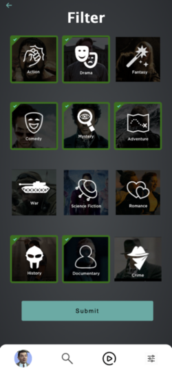

# MovieMatch

## Description

This is a project developed by Pau Mesonero and Guillermo Martin as the project for the second module at Ironhack. The application will try to fill a need within the cinephile community, where many apps are not as user friendly as they should to reach the biggest portion of the casual public.
By just asking for a few opinions about popular movies and genres, the app will just save you a lot of scrolling-down hours looking for anything to watch! Try it out!




## Instructions

When cloning the project, change the <code>sample.env</code> for an <code>.env</code> with the values you consider:
```js
PORT=3000
MONGO_URL='mongodb://localhost/dbName'
SESSION_SECRET='SecretOfYourOwnChoosing'
NODE_ENV='development'
```
Then, run:
```bash
npm install
```
To start the project run:
```bash
npm run start
```

---

## User stories (MVP)

What can the user do with the app?
- User can sign up and create and account.
- User can login.
- User can log out.
- User can vote LIKE or DISLIKE every movie shown.
- User can get recommendations based on its votes.
- Admin can create a movie.
- Admin can delete a movie.
- Admin can edit any movie.


## User stories (Backlog)

- User can also vote 'Ignore' so the movie is not considered an opinion, and is never recommended again.
- User can upload or change a profile picture.
- User can delete its own account.
- User can see its vote history.
- User can filter its own recommendations through genre checkboxes.
- User can visit IMDB through movie-detail links for more information.
- User can sort its own vote history by ranking, popularity or voting date.
- User can sort its own vote history by genres.
- Admins can see the list of registered users.

---

## Models

User:

```js
const userSchema = new Schema(
  {
    username: {
      type: String,
      trim: true,
      required: [true, 'Username is required.'],
      unique: true
    },
    email: {
      type: String,
      required: [true, 'Email is required.'],
      unique: true,
      lowercase: true,
      trim: true
    },
    hashedPassword: {
      type: String,
      required: [true, 'Password is required.']
    },
    imageUrl: {
      type: String,
    },
    isAdmin: Boolean,
    preferences: {
      type: [String],
      default: []
    }
  },
  {
    timestamps: true
  }
);

//Movie (coming from API): 

const movieSchema = new Schema(
    {
        imdb_id: {
            type: String,
            unique: true
        },
        name: {
            type: String,
            unique: true
        },
        year: {
            type: Number,
        },
        image: {
            sm: String,
            md: String,
            lg: String,
            og: String
        },
        premiere: String,
        genres: [String],
        people: [
            {
                imdb_id: String,
                name: String,
                department: String,
                job: String,
                translations: [
                    {
                        country: String,
                        language: String,
                        name: String
                    }
                ]
            },
            {
                imdb_id: String,
                name: String,
                department: String,
                translations: [
                    {
                        country: String,
                        language: String,
                        name: String,
                    }
                ]
            },
            {
                imdb_id: String,
                name: String,
                department: String,
                translations: [
                    {
                        country: String,
                        language: String,
                        name: String
                    }
                ]
            }
        ],
        imdb_rating: Number,
        imdb_vote: Number,
        translations: [
            {
                country: String,
                language: String,
                name: String,
                overview: String,
                poster: {
                    sm: String,
                    md: String,
                    lg: String,
                    og: String
                }
            }
        ],
        handmade: Boolean,
    }
)


//Vote: 

const voteSchema = new Schema(
  {
    userId: {
      type: Schema.Types.ObjectId,
      ref:"User",
    },
    movieId: {
      type: Schema.Types.ObjectId,
      ref:"Movie"
    },
    vote: {
      type: Number,
      required: [true, 'Vote is required.']
    }
  },
  {
    timestamps: true
  }
);
```
---
## API endpoints and usage 

| Name           | Method | Endpoint     | Protected | Req.body            | Redirects |
|----------------|--------|--------------|-----------|---------------------|-----------|
| Home           | GET    | /            | No        |                     |           |

| Profile        | GET    | /auth/profile| No        |                     |           |
| Signup         | GET    | /auth/signup | No        |                     |           |
| Signup         | POST   | /auth/signup | No        | { username, email, password, password2, existingImageSign }||
| Login          | GET    | /auth/login  | No        |                     |           |
| Login          | POST   | /auth/login  | No        | { email, password } |/          |
| Logout         | POST   | /auth/logout | No        |                     |/auth/login|

| Ignored        | GET    | /movies/ignored| No      |                     |           |
| Filter         | GET    | /movies/filter| No       |                     |           |
| Filter         | POST   | /movies/filter| No       |{action, drama, fantasy, comedy, mystery, adventure, war, scifi, romance, history, documentary, crime}| / |
| Congratulations| GET    | /movies/congratulations| No |                  |           |
| Search Movie   | GET    | /movies/search-movie| No |                     |           |
| apiSearch      | GET    | /movies/api-search-by-name| Yes |              |           |
| apiSearch      | GET    | /movies/api-search-by-imdbId| Yes |            |           |
| New movie      | GET    | /movies/create| Yes      |                     |           |
| New movie      | POST   | /movies/create| Yes      | { imdb_id, name, year, image1, premiere, genre1, genre2, genre3, people1, people2, people3, imdb_rating, imdb_vote, poster1, overview }| / |
| Edit movie     | GET    | /movies/:movieId/edit| Yes |                   |          |
| Edit movie     | POST   | /movies/:movieId/edit| Yes | { imdb_id, name, year, image1, premiere, genre1, genre2, genre3, people1, people2, people3, imdb_rating, imdb_vote, poster1, overview }| /movies/:movieId |
| Delete movie   | POST   | /movies/:movieId/delete| Yes |                 |/          |
| My list by date| GET    | /movies/myList/byDate| No |                    |           |
| My list by popularity| GET | /movies/myList/byPopularity| No |           |           |
| My list by rating| GET  | /movies/myList/byRating| No |                  |           |
| My list by genres| GET  | /movies/myList/byGenres| No |                  |           |
| Movie          | GET    | /:movieId    | No        |                     |/congratulations|

| Edit user      | GET    | /user/edit   | No        |                     |           |
| Edit user      | POST   | /user/edit   | No        | { username, email, existingImage }| / |
| Delete user    | GET    | /user/delete | No        |                     |           |
| Delete user    | POST   | /user/delete | No        |                     |/          |
| User list      | GET    | /user/userList| Yes      |                     |           |
| User preferences| GET   | /user/preferences| Yes   | { preferences }     |           |

| Vote Like      | GET    | /votes/:movieId/VoteLike| No |                 |           |
| Vote Like      | POST   | /votes/:movieId/VoteLike| No |                 |/:movieId OR /congratulations           |
| Vote Dislike   | GET    | /votes/:movieId/VoteDislike| No |              |           |
| Vote Dislike   | POST   | /votes/:movieId/VoteDislike| No |              |/:movieId OR /congratulations           |
| Vote Ignore    | GET    | /votes/:movieId/Ignore| No |                   |           |
| Vote Ignore    | POST   | /votes/:movieId/Ignore| No |                   |/:movieId OR /congratulations           |
---

## Useful links

- [Github Repo](https://github.com/Portela44/module2-boilerplate)
- [Deployed version](https://recommend---me.herokuapp.com/)
- [Presentation slides](https://docs.google.com/presentation/d/1nb5ld1qiLS15eh0Pe6Pyt_9-m7XTqG3E5ERNxq8etDE/edit#slide=id.gd2f231c4a7_1_0)
